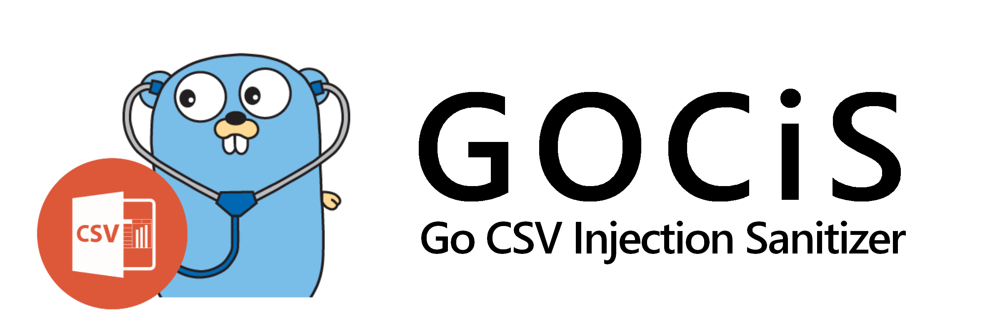

Sanitize your CSV to avoid [**CSV Injection**](https://www.owasp.org/index.php/CSV_Injection).

***

## Explanation

The following `CSV` will execute the Formula `=1+1` with the **Microsoft Excel** or **LibreOffice Calc** opening.

~~~csv
First Name,Second Name,Phone Number,Birth Year
Bob,Doe,123123123,1994
Alice,Cooper,321321321,1993
PoC,CSVi,=1+1,@test
~~~

To avoid this injection, is enough to add a blankspace before the `=` sign.

The output CSV will be:

~~~csv
First Name,Second Name,Phone Number,Birth Year
Bob,Doe,123123123,1994
Alice,Cooper,321321321,1993
PoC,CSVi, =1+1, @test
~~~

***

## Usage

Usage:

~~~bash
go run GOCiS.go -in original.csv -out sanitized.csv
~~~

***

## About CSV Injection

Accorging to [**OWASP: CSV Injection**](https://www.owasp.org/index.php/CSV_Injection):

CSV Injection, also known as Formula Injection, occurs when websites embed untrusted input inside CSV files.

 When a spreadsheet program such as **Microsoft Excel** or **LibreOffice Calc** is used to open a `CSV`, any cells starting with `=` will be interpreted by the software as a formula. Maliciously crafted formulas can be used for three key attacks:

  + Hijacking the user's computer by exploiting vulnerabilities in the spreadsheet software, such as [**CVE-2014-3524**](https://cve.mitre.org/cgi-bin/cvename.cgi?name=CVE-2014-3524).
  + Hijacking the user's computer by exploiting the user's tendency to ignore security warnings in spreadsheets that they downloaded from their own website.
  + Exfiltrating contents from the spreadsheet, or other open spreadsheets.

 This attack is **difficult to mitigate**, and explicitly disallowed from quite a few bug bounty programs. To remediate it, ensure that no cells begin with any of the following characters:

  + Equals to (`=`)
  + Plus (`+`)
  + Minus (`-`)
  + At (`@`)
